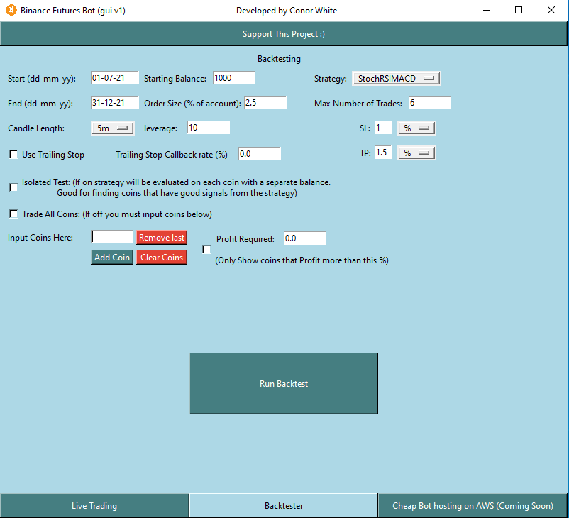

# Binance-Futures-Trading-Bot [](https://twitter.com/intent/tweet?text=Check%20out%20this%20free%20Binance%20Trading%20Bot%20I%20found%20on%20Github%20&url=https://github.com/conor19w/Binance-Futures-Trading-Bot&hashtags=Trading,Bot,Trading_Bot,Cryptocurrency_Trading_Bot,Crypto,Bitcoin,Ethereum,Cryptocurrency,Binance,DOGE,dogecoin) #
## Technical Analysis driven Crypto Trading bot on Binance Futures 📈 ₿ 🚀 [](https://twitter.com/intent/tweet?text=Check%20out%20this%20free%20Binance%20Trading%20Bot%20I%20found%20on%20Github%20&url=https://github.com/conor19w/Binance-Futures-Trading-Bot&hashtags=Trading,Bot,Trading_Bot,Cryptocurrency_Trading_Bot,Crypto,Bitcoin,Ethereum,Cryptocurrency,Binance,DOGE,dogecoin) ##
[__Join My public Discord Server__](https://discord.gg/jBu6thyP66) __&__ [__Follow The Twitter__](https://twitter.com/futures_bot)
* Create a [Binance Account](https://accounts.binance.com/en/register?ref=BKR8BMMP) (This link uses my referral which gives you 5% kickback on trades & would be greatly appreciated)
* Want me to host a Bot for you on AWS, I have a [monthly tier](https://github.com/sponsors/conor19w) available for this join & I'll get in touch to get you set up 😃
* Write your own functions to implement your TA strategies.
* Comes with some pre-coded strategies found in [TradingStrats.py](https://github.com/conor19w/Binance-Futures-Trading-Bot/blob/main/TradingStrats.py)
* If you enjoy the repo please share it around to friends & tweet about it using the tweet button above 😃   
or [Buy me a Coffee](https://www.buymeacoffee.com/conor19w)
* Prioritise your [Trello](https://trello.com/invite/b/iagTNiv0/80cc1828bdac439ed813cc54c9698c06/github-bot) ticket with a [one-off-payment](https://github.com/sponsors/conor19w)
* [One time payment](https://github.com/sponsors/conor19w) for custom strategies available also.
* Works best with Python 3.8.10 on Linux.
* On Windows you may run into issues, using the docker file / reducing the number of coins you are trading might help
* Utilizes [python-Binance](https://python-binance.readthedocs.io/en/latest/) Client to execute orders and pull data from Binance
* Utilizes [ta](https://technical-analysis-library-in-python.readthedocs.io/en/latest/) library for Technical indicators
* [Set up windows to sync time once a day](https://www.makeuseof.com/tag/synchronise-computer-time-internet-custom-schedule-windows-7/#:~:text=Go%20to%20%3E%20Start%20and%20type,on%20the%20right%20hand%20side) if you don't do this binance will eventually reject orders with a timestamp error.

---
## Binance Setup ##
* Create a [Binance Account](https://accounts.binance.com/en/register?ref=BKR8BMMP) (This link uses my referral which gives you 5% kickback on trades & would be greatly appreciated)
* __Enable Two-factor Authentication in the security section to keep your crypto safe.__
* Create a new API key under the API Management section.
*  [✓] Read Info [✓] Enable Trading [✓] Enable Futures [X] Enable Withdrawals
* Whitelist your IP address to further secure your account, and so that your API keys don't expire after 3 months.
* Fill in your api keys into api_secret and api_key in __Config_File.py__
* [Set up windows to sync time once a day](https://www.makeuseof.com/tag/synchronise-computer-time-internet-custom-schedule-windows-7/#:~:text=Go%20to%20%3E%20Start%20and%20type,on%20the%20right%20hand%20side) if you don't do this binance will eventually reject orders with a timestamp error.
---
### For running Bot with cloud provider, Run directly from Live_Bot.py as you can't use the GUI ###
__Run strategies at your own risk I am not responsible for your trading decisions, futures are risky and proper risk management should be adhered to at all times, always have a stoploss__
```commandline
python3 Live_Bot.py
```
* Settings are in __Config_File.py__
* Trade a single position at a time by setting ```Number_Of_Trades = 1```, to trade multiple coins just increment this value.
* Choose the ```Interval``` you want to trade and the ```buffer``` of candlesticks your strategy will need this will be dependent on indicators you need to ensure you have a sufficient buffer, or you will get errors.
* ```leverage``` and ```order_Size``` should be changed according to your preference
* ```symbol[]``` is a list of the symbols you wish to trade, If you wish to trade all symbols set ```Trade_All_Coins = True```.
* __Trailing stop: set ```use_trailing_stop = 1``` and change ```trailing_stop_percent``` to suit your strategy to use the trailing stop (Min val .001 i.e .1%, Max 5 i.e. 5%). The trailing stop will be placed when the take profit value margin of increase/decrease is reached from your strategy__.
* To close a trade based off a condition check_close_pos() must return a close_pos flag.
* ```strategy``` is the name of the strategy you want to use, see below for adding your own custom strategies.
* ```TP_choice``` and ```SL_choice``` correspond to the type of SL/TP seen in the dropdowns in the GUI see below for adding custom ones.
* ```SL_mult``` and ```TP_mult``` correspond to the numbers preceding the TP and SL choice dropdowns.

__Docker container creation__ (Recommended for anyone having issues running the bot):
* Navigate to the project directory in your terminal window
* Run the following Command this will create a docker image with the current state of your Config.py and choice of strategy in Bot_Class.py:

Sample docker commands that I use, __note yours may be different__ (`sudo` may not be needed for you):
```shell
sudo docker build --tag live_bot .
sudo docker run -it live_bot
```

---
### GUI for Backtesting and Live Trading (locally) ###
__Just Run ```app.py``` to get the GUI__
```commandline
python3 app.py
```

* Backtests are displayed in the terminal while running, the results are then saved to a csv file in the current directory along with a graph image.  


#### Creating Custom Strategies: ####
__Strategies are implemented in Bot_Class as functions in Make_decision()__
* ```Make_decision()``` must return ```Trade_Direction, stop_loss_val, take_profit_val``` for the strategy to work properly
* You might draw inspiration for a strategy from one of the samples in __TradingStrats.py__  
[Create Custom Strategies & TP/SL functions Manual](files/Custom_Strategies.pdf)
---
### YouTube Channels with Strategy Ideas: ###
[__Silicon Trader__](https://www.youtube.com/channel/UCVRGsC6JVsB8F6HE_xjLyJg) | [__Trade Pro__](https://www.youtube.com/channel/UCrXjzUN6EtlyhaaAerbPfkQ) | [__Strategy Testing__](https://www.youtube.com/c/TradingStrategyTesting) | [__Trading Journal__](https://www.youtube.com/c/TradingJournal1) |  [__The Moving Average__](https://www.youtube.com/channel/UCYFQzaZyTUzY-Tiytyv3HhA)  

---
## TO-DO List: ##
[Trello Board](https://trello.com/invite/b/iagTNiv0/80cc1828bdac439ed813cc54c9698c06/github-bot)
## Latest Changes (if any): ##
* Added a GUI just run app.py (23/07/22)
* Improved Backtester speed (23/07/22)
---
# Contact me [](https://twitter.com/intent/tweet?text=Check%20out%20this%20free%20Binance%20Trading%20Bot%20I%20found%20on%20Github%20&url=https://github.com/conor19w/Binance-Futures-Trading-Bot&hashtags=Trading,Bot,Trading_Bot,Cryptocurrency_Trading_Bot,Crypto,Bitcoin,Ethereum,Cryptocurrency,Binance,DOGE,dogecoin) #
* If you have any queries about anything, or need me to explain any blocks of code please reach out to me on [Discord](https://discord.gg/jBu6thyP66).
* If you have any suggestions or requests please reach out to me as well.  
[__Join My public Discord Server__](https://discord.gg/jBu6thyP66) __&__ [__Follow The Twitter__](https://twitter.com/futures_bot)
* Want me to host a Bot for you on AWS, I have a [monthly tier](https://github.com/sponsors/conor19w) available for this join & I'll get in touch to get you set up 😃

